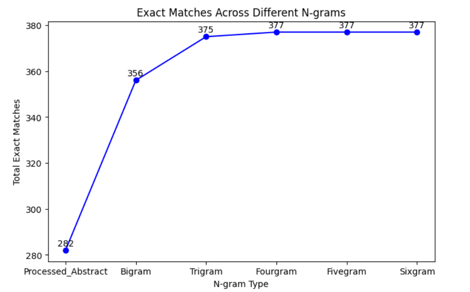

# Project 1: Text Analysis for QTL Research Papers

## Overview

This project analyzes text from QTL-related research papers to extract important terms, visualize patterns, and train models for word relationships. It involves data preprocessing, phrase extraction, word cloud generation, Word2Vec modeling, and trait dictionary matching.

## Features

- **Preprocesses text** by tokenizing, lowercasing, and removing stopwords.
- **Extracts n-grams (bigrams to sixgrams)** for better phrase representation.
- **Generates word clouds** to visualize frequent and significant terms.
- **Trains a Word2Vec model** to identify relationships between words.
- **Compares extracted phrases** with a predefined trait dictionary.
- **Performs exact string matching** to evaluate the presence of extracted terms in the trait dictionary.
- **Visualizes exact match trends** across different n-grams.

# Project 2: QTL Paper Classification (Logistic Regression + BERT)
## Overview
This project automates the classification of research papers into:

1 → Relevant for QTLdb curation

0 → Not relevant

It combines traditional machine learning (TF-IDF + Logistic Regression) with a fine-tuned BERT model using an ensemble approach for optimal results.

## Features
* Cleans and balances the input dataset.
* Trains two independent models:
   * Logistic Regression (TF-IDF)
   * BERT (fine-tuned transformer)
* Uses class weights to handle imbalance during BERT training.
* Applies threshold optimization for best F1 score on validation set.
* Combines predictions via soft-voting ensemble.
* Generates final predictions for Kaggle competition.

## Installation

1. Clone this repository:
   ```bash
   git clone https://github.com/koshtiakanksha/text_analysis_for_qtl_research.git
   cd text_analysis_for_qtl_research
   ```
2. Install dependencies:
   ```bash
   pip install -r requirements.txt
   ```
3. Run Jupyter Notebook:
   ```bash
   jupyter notebook Project_1_akoshti.ipynb
   ```
4. Ensure that the dataset files (`QTL_text.json` and `Trait dictionary.txt`) are in the project directory.

## How to Run

- Open and execute the Jupyter Notebook (`Project_1_akoshti.ipynb`).
- The script will:
  1. Load and clean text data.
  2. Generate word clouds for frequency-based and TF-IDF terms.
  3. Train a Word2Vec model for different n-grams.
  4. Extract and match phrases with the trait dictionary.
  5. Display results, including exact matches and similarity analysis.
  6. Visualize trends in exact matches across n-grams.

## Results Summary

### **Word Cloud Analysis:**

- **Word frequency-based clouds** showed common terms but included generic words.
- **TF-IDF-based clouds** highlighted more meaningful phrases, becoming more detailed with higher n-grams.
- Higher n-grams captured more precise biological expressions, but redundancy increased beyond trigrams.

### **Word2Vec Similarity Analysis:**

- Similar words remained consistent across different n-grams.
- Increasing n-gram length did not significantly improve word relationships.
- Most meaningful insights were captured within bigrams and trigrams, making higher n-grams redundant.

### **Exact String Matching with Trait Dictionary:**

- **Processed abstracts had 282 exact matches.**
- **Bigrams significantly improved matches to 356.**
- **Trigrams showed further improvement, reaching 375 matches.**
- **Beyond trigrams (fourgrams, fivegrams, sixgrams), the gain was minimal (377 matches).**
- **Conclusion:** Extracting bigrams and trigrams is sufficient for capturing relevant phrases; higher n-grams add little value.

### **Graph Summary:**


- The graph below shows exact matches across different n-grams.
- A sharp increase in matches occurs from unigrams to bigrams and trigrams.
- After trigrams, the increase plateaus, confirming that using fourgrams and beyond provides minimal additional benefit.


## Future Improvements

- **Improve phrase extraction** using lemmatization and more advanced phrase detection.
- **Expand the trait dictionary** to capture more variations in terminology.
- **Enhance Word2Vec training** with larger datasets to improve accuracy.
- **Test fuzzy matching** to identify near-exact matches instead of strict exact matching.

## Contributions

Feel free to fork the repository, improve the code, and submit a pull request.

## License

This project is for academic and research purposes only.

